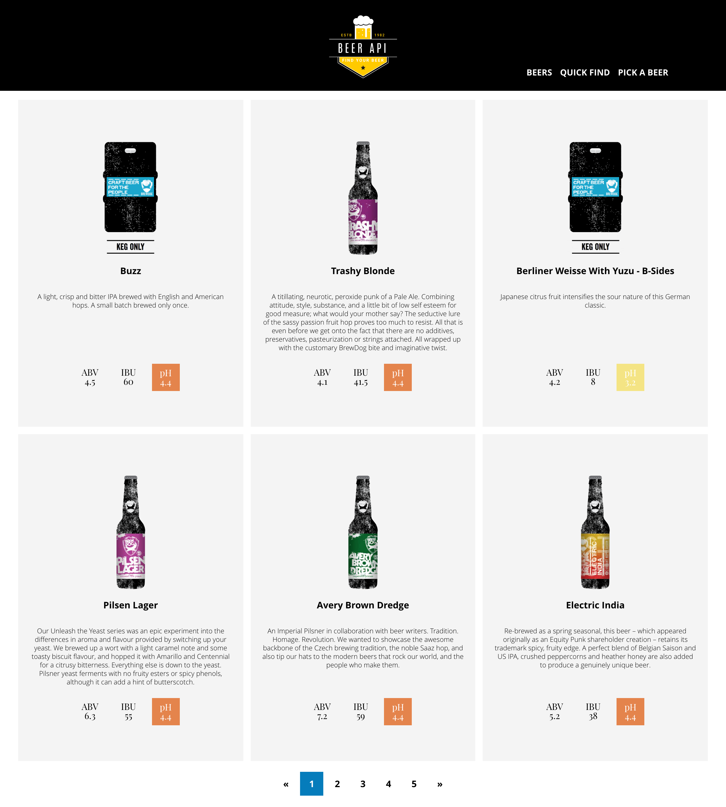
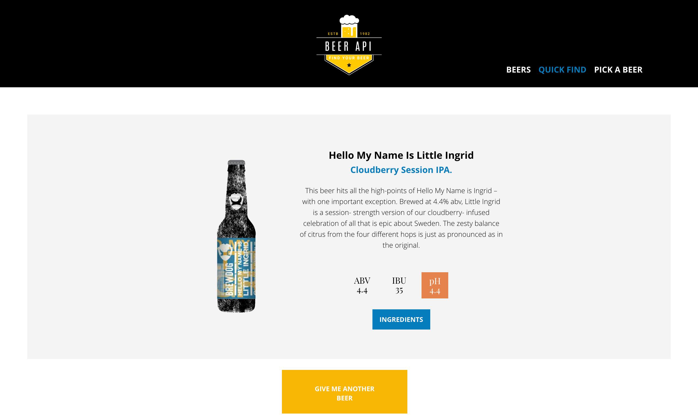
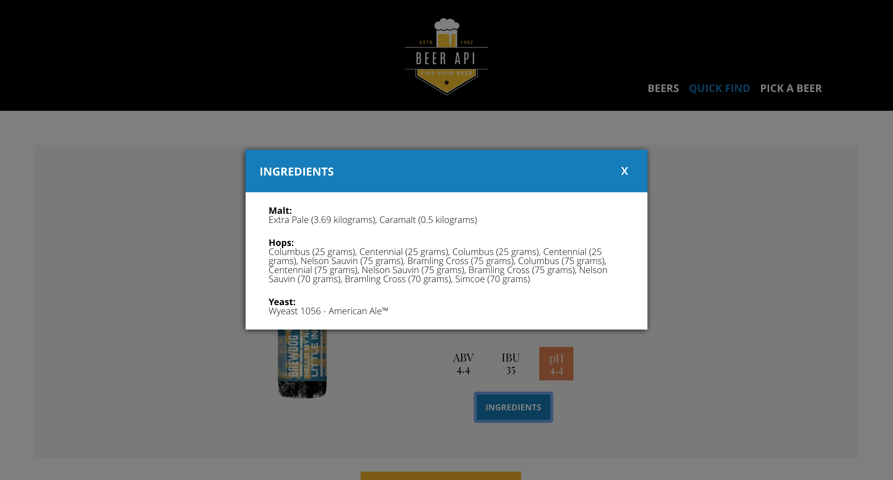
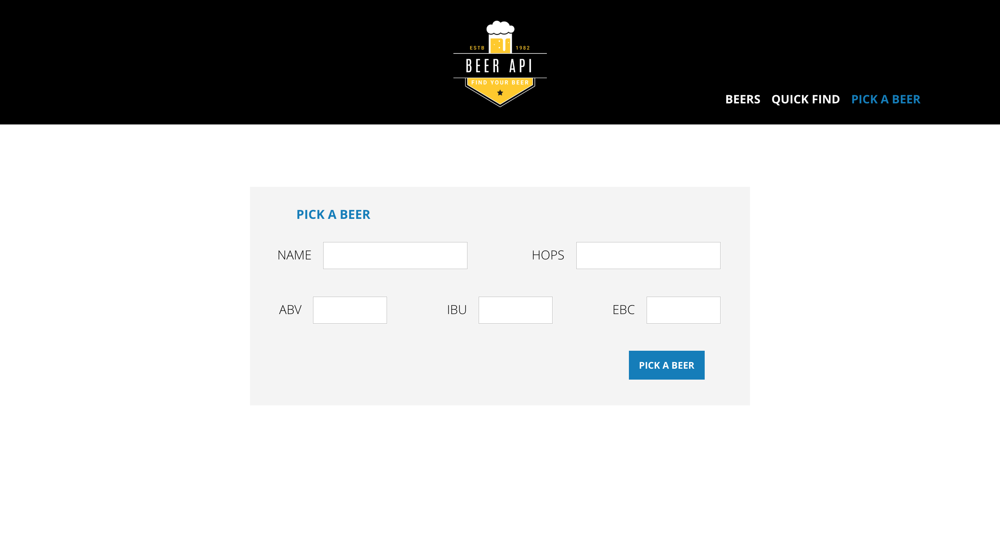

# Project: BEER-API
## About this project
You can see this project on-line, going to [BEER API](https://paulpetillot.github.io/beer-api/build/#)

----
## Goals of the site
This site has been created to learn how to create a web site using SASS, JQUERY, JAVASCRIPT ES6, AJAX. 

----
## Technology used
HTML5 | SASS | JavaScript ES6 | JQuery | Github | Git | Ajax |

----
## JavaScript  features
JQUERY and Ajax | API  | Event handlers | ES6 | OOP |

----
## Personal Learnings

1. JQuery Events, DOM, Methods, Ajax and oriented object programming
2. JS 
3. SCSS with Grid

----
## Link to the files on Github
* **[BEER API](https://paulpetillot.github.io/beer-api/build/#)

----
## Device Screenshots
**Desktop**
----

----
## Dead Line for the project
* 8-Nov-2018

----
## Project developed by 
 **[Paul Petillot]
(https://github.com/PaulPetillot)**
